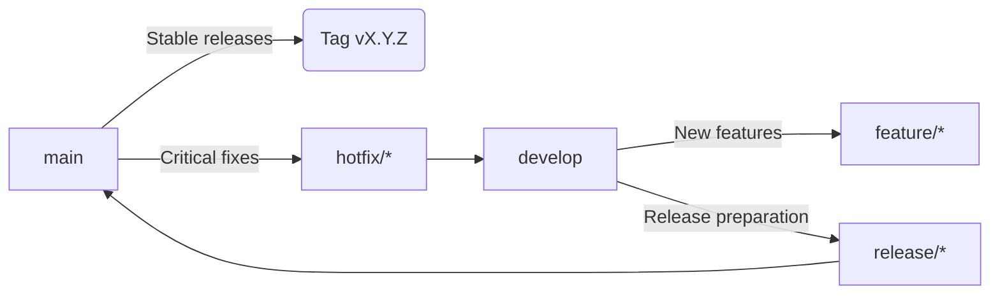

# VoyagerSD Development and Release Guide

## 📋 Table of Contents
1. [Branching Model](#-branching-model)
2. [Development Process](#-development-process)
3. [Release Preparation](#-release-preparation)
4. [Release Publication](#-release-publication)
5. [Hotfixes](#-hotfixes)
6. [Versioning (SemVer)](#-versioning-semver)
7. [CI/CD Rules](#-cicd-rules)
8. [Makefile Commands](#-makefile-commands)
9. [Common Mistakes](#-common-mistakes)
10. [Responsibilities](#-responsibilities)
11. [Future Considerations](#-future-considerations)

## 🌿 Branching Model


## 💻 Development Process

### For new functionality:
1. Create feature branch from `develop`:
```bash
git checkout develop
git pull
git checkout -b feature/short-description
```

2. Commit changes regularly:
```bash
git add .
git commit -m "feat: add new functionality"
```

3. When work is complete:
```bash
git push origin feature/short-description
# Create Pull Request to develop
```

4. Pull Request requirements:
- Minimum 1 approval from team member
- All tests must pass (`make test`)
- Code style compliance (`make lint`)
- Synced with base branch

## 🚀 Release Preparation

1. Create release branch:
```bash
git checkout develop
git pull
git checkout -b release/vX.Y.Z
```

2. In release branch:
- Update `CHANGELOG.md` with release date
- Perform final testing
- Fix critical bugs (no new features!)
- Ensure all checks pass:
```bash
make release-test  # Runs lint, test and other validations
```

## 🏷️ Release Publication

1. Merge release branch to `main`:
```bash
git checkout main
git pull
git merge --no-ff release/vX.Y.Z
```

2. Create version tag:
```bash
git tag -a vX.Y.Z -m "Release vX.Y.Z"
```

3. Push changes:
```bash
git push origin main
git push origin --tags
```

4. Update `develop` branch:
```bash
git checkout develop
git merge --no-ff release/vX.Y.Z
git push origin develop
```

5. Delete release branch:
```bash
git branch -d release/vX.Y.Z
```

## 🔥 Hotfixes

1. Create hotfix branch from `main`:
```bash
git checkout main
git pull
git checkout -b hotfix/short-description
```

2. Apply necessary fixes:
```bash
git add .
git commit -m "fix: resolve critical issue"
```

3. Merge to `main`:
```bash
git checkout main
git merge --no-ff hotfix/short-description
```

4. Create patch version tag:
```bash
git tag -a vX.Y.(Z+1) -m "Hotfix vX.Y.(Z+1)"
git push origin main --tags
```

5. Update `develop` branch:
```bash
git checkout develop
git merge --no-ff hotfix/short-description
git push origin develop
```

## 🔢 Versioning (SemVer)

We use Semantic Versioning: `MAJOR.MINOR.PATCH`

- `MAJOR` (X): Breaking changes requiring migration
- `MINOR` (Y): New functionality with backward compatibility
- `PATCH` (Z): Bug fixes with backward compatibility

### Examples:
- `v1.0.0`: First stable release
- `v1.1.0`: New features added
- `v1.1.1`: Critical bug fix
- `v2.0.0`: Breaking API changes

### Pre-releases:
- `v1.2.0-beta.1`: Beta version before release
- `v1.2.0-rc.2`: Release candidate

## 🤖 CI/CD Rules

1. Automated actions:
   - `v*` tags automatically trigger release pipeline
   - GitHub Release entry created
   - Docker images built and published
   - Build artifacts published

2. Release requirements:
   - All unit tests pass (`make test`)
   - Integration tests successful
   - Code quality checks pass (`make lint`)
   - Artifacts built without errors

3. Prohibited:
   - Manual releases bypassing CI/CD
   - Modifying published artifacts
   - Force-pushing to release branches

## 🛠️ Makefile Commands

```bash
# Run all release validation checks
make release-test

# Prepare release branch (replace X.Y.Z with version)
make release-prepare VERSION=vX.Y.Z

# Publish release (after successful validation)
make release-publish VERSION=vX.Y.Z

# Abort release (in case of issues)
make release-abort VERSION=vX.Y.Z

# Full release via GoReleaser (CI only)
make goreleaser-release
```

## ❌ Common Mistakes

1. **Direct commits to main**  
   All changes to main must go through Pull Requests.

2. **Manual version changes in code**  
   Version should only be set through Git tags.

3. **Merging feature branches directly to main**  
   New features should reach main only through release branches.

4. **Force-pushing to release branches**  
   Rewriting history breaks testing and CI/CD pipelines.

5. **Missing CHANGELOG updates**  
   All releases must be documented in CHANGELOG.md.

## 👥 Responsibilities

1. **Technical Lead**
   - Approves release branches
   - Oversees merge process
   - Makes final release decisions

2. **CI/CD Engineer**
   - Maintains build pipeline
   - Responds to CI/CD failures
   - Optimizes build process

3. **Developers**
   - Follow branching model
   - Keep CHANGELOG.md updated
   - Conduct peer code reviews

## 🔮 Future Considerations

### macOS Compatibility Update
GitHub Actions will migrate the `macos-latest` label to macOS 15 on August 4, 2025.

To prepare:
1. Test VoyagerSD on macOS 15 beta when available
2. Verify compatibility with new OS features
3. Update dependencies if needed
4. Consider pinning to `macos-14` for critical production pipelines

For more information:
https://github.com/actions/runner-images/issues/12520

### Ongoing Maintenance
- Regularly update dependencies (`make tidy`)
- Monitor GitHub Actions announcements
- Test on new OS versions proactively
- Update this guide as processes evolve

---

> **Important**: This process is mandatory for all project contributors.  
> Improvement suggestions should be submitted through Issues.
