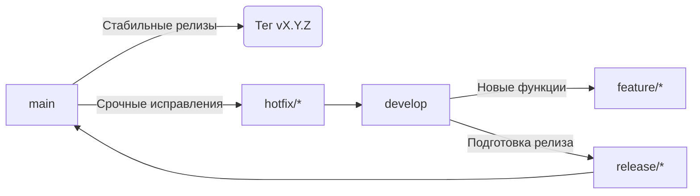

# Руководство по разработке и релизам VoyagerSD

## 📋 Содержание
1. [Модель ветвления](#модель-ветвления)
2. [Процесс разработки](#процесс-разработки)
3. [Подготовка релиза](#подготовка-релиза)
4. [Публикация релиза](#публикация-релиза)
5. [Срочные исправления (Hotfix)](#срочные-исправления-hotfix)
6. [Версионирование (SemVer)](#версионирование-semver)
7. [Правила CI/CD](#правила-cicd)
8. [Команды Makefile](#команды-makefile)
9. [Частые ошибки](#частые-ошибки)
10. [Ответственные](#ответственные)
11. [Будущие соображения](#будущие-соображения)
12. [Лучшие практики истории коммитов](#лучшие-практики-истории-коммитов)

## 🌿 Модель ветвления


## 💻 Процесс разработки

### Для новой функциональности:
1. Создайте feature-ветку от `develop`:
```bash
git checkout develop
git pull
git checkout -b feature/short-description
```

2. Регулярно коммитьте изменения с семантическими сообщениями на английском:
```bash
git add .
git commit -m "feat: add metrics endpoint"
```

3. После завершения работы:
```bash
git push origin feature/short-description
# Создать Pull Request в develop
```

4. Требования к Pull Request:
- Минимум 1 апрув от участника команды
- Все тесты должны проходить (`make test`)
- Соответствие стилю кода (`make lint`)
- Актуальность с основной веткой
- Сообщения коммитов на английском языке

## 🚀 Подготовка релиза

1. Создайте ветку релиза:
```bash
git checkout develop
git pull
git checkout -b release/vX.Y.Z
```

2. В ветке релиза выполните:
- Обновите `CHANGELOG.md` с датой релиза и изменениями
- Проведите финальное тестирование
- Исправьте критические баги (без добавления новых функций!)
- Убедитесь, что все проверки проходят:
```bash
make release-test  # Запуск lint, test и других проверок
```

## 🏷️ Публикация релиза

1. **Сквош и подготовка коммитов релиза**:
   ```bash
   # Интерактивный rebase для сквоша коммитов
   git rebase -i develop
   
   # Перезапись сообщений коммитов по соглашению
   git filter-branch -f --msg-filter '
     sed -e "s/^feat:/release: feat:/" \
         -e "s/^fix:/release: fix:/" \
         -e "s/^chore:/release: chore:/"
   ' HEAD
   ```

2. Смержьте ветку релиза в `main`:
```bash
git checkout main
git pull
git merge --no-ff release/vX.Y.Z
```

3. Создайте тег версии на английском:
```bash
git tag -a vX.Y.Z -m "Release vX.Y.Z"
```

4. Запушьте изменения:
```bash
git push origin main
git push origin --tags
```

5. Обновите ветку `develop`:
```bash
git checkout develop
git merge --no-ff release/vX.Y.Z
git push origin develop
```

6. Удалите ветку релиза:
```bash
git branch -d release/vX.Y.Z
```

## 🔥 Срочные исправления (Hotfix)

1. Создайте hotfix-ветку от `main`:
```bash
git checkout main
git pull
git checkout -b hotfix/short-description
```

2. Внесите необходимые исправления атомарными коммитами на английском:
```bash
git add .
git commit -m "fix: resolve connection leak"
```

3. Сквош коммитов для hotfix:
```bash
# Для hotfix из одного коммита сквош не требуется
# Для многокоммитных hotfix:
git rebase -i main
```

4. Смержьте исправление в `main`:
```bash
git checkout main
git merge --no-ff hotfix/short-description
```

5. Создайте тег версии (патч-релиз) на английском:
```bash
git tag -a vX.Y.(Z+1) -m "Hotfix vX.Y.(Z+1)"
git push origin main --tags
```

6. Обновите ветку `develop`:
```bash
git checkout develop
git merge --no-ff hotfix/short-description
git push origin develop
```

## 🔢 Версионирование (SemVer)

Используем семантическое версионирование: `MAJOR.MINOR.PATCH`

- `MAJOR` (X): Критические изменения, ломающие обратную совместимость
- `MINOR` (Y): Новая функциональность с сохранением обратной совместимости
- `PATCH` (Z): Исправления ошибок с сохранением обратной совместимости

### Примеры:
- `v1.0.0`: Первый стабильный релиз
- `v1.1.0`: Добавление новых функций
- `v1.1.1`: Исправление критического бага
- `v2.0.0`: Ломающие изменения, требующие миграции

### Пре-релизы:
- `v1.2.0-beta.1`: Бета-версия перед релизом
- `v1.2.0-rc.2`: Release candidate

## 🤖 Правила CI/CD

1. Автоматические действия:
   - Теги `v*` автоматически запускают релизный пайплайн
   - Создается запись в GitHub Releases
   - Собираются Docker-образы
   - Публикуются артефакты сборки

2. Условия успешного релиза:
   - Все юнит-тесты пройдены (`make test`)
   - Интеграционные тесты успешны
   - Проверка качества кода пройдена (`make lint`)
   - Сборка артефактов выполнена без ошибок
   - Все сообщения коммитов на английском языке

3. Запрещено:
   - Публиковать релизы вручную минуя CI/CD
   - Изменять артефакты после публикации
   - Использовать force-push в релизных ветках
   - Мержить релизные ветки без сквоша коммитов
   - Использовать неанглийские сообщения в коммитах и тегах

## 🛠️ Команды Makefile

```bash
# Запуск всех проверок перед релизом
make release-test

# Подготовка ветки релиза (заменяет X.Y.Z на версию)
make release-prepare VERSION=vX.Y.Z

# Публикация релиза (после всех проверок)
make release-publish VERSION=vX.Y.Z

# Отмена релиза (в случае проблем)
make release-abort VERSION=vX.Y.Z

# Полный релиз через GoReleaser (только в CI)
make goreleaser-release

# Сквош коммитов релиза (локальная подготовка)
make release-squash VERSION=vX.Y.Z
```

## ❌ Частые ошибки

1. **Прямые коммиты в main**  
   Все изменения в main должны проходить через Pull Request.

2. **Ручное изменение версии в коде**  
   Версия должна устанавливаться только через теги.

3. **Мерж feature-веток прямо в main**  
   Все новые функции должны попадать в main только через релизные ветки.

4. **Force push в релизные ветки**  
   Перезапись истории ломает процесс тестирования и CI/CD.

5. **Отсутствие CHANGELOG обновлений**  
   Все релизы должны документироваться в CHANGELOG.md.

6. **Неструктурированная история коммитов в релизах**  
   Ветки релизов должны иметь чистые, атомарные коммиты перед мержем в main.

7. **Коммиты на русском языке**  
   Все сообщения коммитов и тегов должны быть на английском.

## 👥 Ответственные

1. **Технический лид**
   - Утверждает ветки релизов
   - Контролирует процесс слияния
   - Проверяет чистоту истории коммитов
   - Принимает решение о публикации
   - Обеспечивает англоязычные коммиты

2. **CI/CD инженер**
   - Контролирует пайплайн сборки
   - Обеспечивает целостность артефактов
   - Управляет автоматизацией релизов
   - Мониторит security-сканирование

3. **Менеджер релизов**
   - Координирует процесс релиза
   - Проверяет точность CHANGELOG
   - Выполняет операции сквоша
   - Поддерживает документацию по релизам
   - Проверяет язык сообщений

4. **Разработчики**
   - Следуют процессу ветвления
   - Поддерживают атомарность коммитов
   - Своевременно обновляют CHANGELOG.md
   - Проводят код-ревью коллег
   - Используют английский для коммитов

## 🔄 Лучшие практики истории коммитов

### Зачем делать сквош коммитов в релизных ветках?
1. **Чистая история в main**  
   Основная ветка должна содержать только значимые, протестированные точки релизов

2. **Атомарные релизы**  
   Каждый релиз соответствует единому логическому набору изменений

3. **Упрощенный откат**  
   Отмена релиза становится операцией в один шаг

4. **Прозрачность аудита**  
   Security-аудиты и код-ревью выполняются эффективнее

5. **Целостность релиза**  
   Гарантирует, что все промежуточные состояния были должным образом протестированы

### Как правильно делать сквош:
```bash
# 1. Переключитесь на ветку релиза
git checkout release/vX.Y.Z

# 2. Интерактивный rebase относительно develop
git rebase -i develop

# 3. В редакторе замените 'pick' на 'squash' или 'fixup' для несущественных коммитов
pick a1b2c3d feat: add metrics endpoint
squash d4e5f6a fix: resolve linter warnings
fixup e7f8g9h chore: update comments

# 4. Перезапишите сообщения коммитов по соглашению
git filter-branch -f --msg-filter '
  sed -e "s/^feat:/release: feat:/" \
      -e "s/^fix:/release: fix:/" \
      -e "s/^chore:/release: chore:/"
' HEAD

# 5. Проверьте историю
git log --oneline
```

### Золотые правила:
1. Никогда не делайте сквош после запуска CI
2. Всегда тестируйте после сквоша
3. Сохраняйте семантические типы сообщений (feat, fix и т.д.)
4. Все сообщения должны быть на английском
5. Включайте ссылки на issues, где применимо
6. Проверяйте с помощью `git diff` относительно оригинальной ветки

## 🔮 Будущие соображения

#### Обновление совместимости macOS
GitHub Actions перенесет метку `macos-latest` на macOS 15 с 4 августа 2025 года.

Для подготовки:
1. Протестируйте VoyagerSD на бета-версии macOS 15, когда она станет доступной
2. Проверьте совместимость с новыми функциями ОС
3. Обновите зависимости при необходимости
4. Рассмотрите возможность закрепления версии `macos-14` для критичных продакшен-пайплайнов

Дополнительная информация:
https://github.com/actions/runner-images/issues/12520

#### Постоянное сопровождение
- Регулярно обновляйте зависимости (`make tidy`)
- Аудит истории коммитов ежеквартально
- Автоматизируйте операции сквоша где возможно
- Следите за объявлениями GitHub Actions
- Обновляйте это руководство по мере развития процессов
- Поддерживайте англоязычные коммиты

---

> **Важно**: Этот процесс обязателен для всех участников проекта.  
> Сообщения коммитов и тегов должны быть только на английском языке.  
> Любые предложения по улучшению обсуждаем через Issues.
