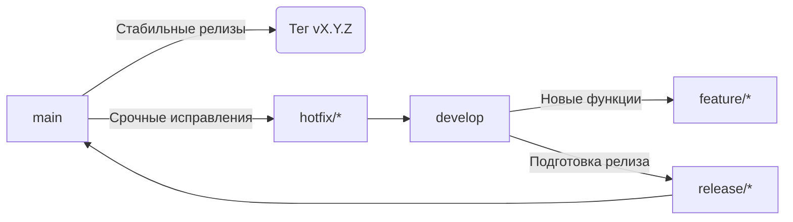

# Руководство по разработке и релизам VoyagerSD

## 📋 Содержание
1. [Модель ветвления](#модель-ветвления)
2. [Процесс разработки](#процесс-разработки)
3. [Подготовка релиза](#подготовка-релиза)
4. [Публикация релиза](#публикация-релиза)
5. [Срочные исправления (Hotfix)](#срочные-исправления-hotfix)
6. [Версионирование (SemVer)](#версионирование-semver)
7. [Правила CI/CD](#правила-cicd)
8. [Команды Makefile](#команды-makefile)
9. [Частые ошибки](#частые-ошибки)
10. [Ответственные](#ответственные)

## 🌿 Модель ветвления


## 💻 Процесс разработки

### Для новой функциональности:
1. Создайте feature-ветку от `develop`:
```bash
git checkout develop
git pull
git checkout -b feature/краткое-описание
```

2. Регулярно коммитьте изменения:
```bash
git add .
git commit -m "feat: добавить новую функциональность"
```

3. После завершения работы:
```bash
git push origin feature/краткое-описание
# Создать Pull Request в develop
```

4. Требования к Pull Request:
- Минимум 1 апрув от участника команды
- Все тесты должны проходить (`make test`)
- Соответствие стилю кода (`make lint`)
- Актуальность с основной веткой

## 🚀 Подготовка релиза

1. Создайте ветку релиза:
```bash
git checkout develop
git pull
git checkout -b release/vX.Y.Z
```

2. В ветке релиза выполните:
- Обновите `CHANGELOG.md` с датой релиза
- Проведите финальное тестирование
- Исправьте критические баги (без добавления новых функций!)
- Убедитесь, что все проверки проходят:
```bash
make release-test  # Запуск lint, test и других проверок
```

## 🏷️ Публикация релиза

1. Смержьте ветку релиза в `main`:
```bash
git checkout main
git pull
git merge --no-ff release/vX.Y.Z
```

2. Создайте тег версии:
```bash
git tag -a vX.Y.Z -m "Релиз vX.Y.Z"
```

3. Запушьте изменения:
```bash
git push origin main
git push origin --tags
```

4. Обновите ветку `develop`:
```bash
git checkout develop
git merge --no-ff release/vX.Y.Z
git push origin develop
```

5. Удалите ветку релиза:
```bash
git branch -d release/vX.Y.Z
```

## 🔥 Срочные исправления (Hotfix)

1. Создайте hotfix-ветку от `main`:
```bash
git checkout main
git pull
git checkout -b hotfix/краткое-описание
```

2. Внесите необходимые исправления:
```bash
git add .
git commit -m "fix: исправить критическую ошибку"
```

3. Смержьте исправление в `main`:
```bash
git checkout main
git merge --no-ff hotfix/краткое-описание
```

4. Создайте тег версии (патч-релиз):
```bash
git tag -a vX.Y.(Z+1) -m "Hotfix vX.Y.(Z+1)"
git push origin main --tags
```

5. Обновите ветку `develop`:
```bash
git checkout develop
git merge --no-ff hotfix/краткое-описание
git push origin develop
```

## 🔢 Версионирование (SemVer)

Используем семантическое версионирование: `MAJOR.MINOR.PATCH`

- `MAJOR` (X): Критические изменения, ломающие обратную совместимость
- `MINOR` (Y): Новая функциональность с сохранением обратной совместимости
- `PATCH` (Z): Исправления ошибок с сохранением обратной совместимости

### Примеры:
- `v1.0.0`: Первый стабильный релиз
- `v1.1.0`: Добавление новых функций
- `v1.1.1`: Исправление критического бага
- `v2.0.0`: Ломающие изменения, требующие миграции

### Пре-релизы:
- `v1.2.0-beta.1`: Бета-версия перед релизом
- `v1.2.0-rc.2`: Release candidate

## 🤖 Правила CI/CD

1. Автоматические действия:
   - Теги `v*` автоматически запускают релизный пайплайн
   - Создается запись в GitHub Releases
   - Собираются Docker-образы
   - Публикуются артефакты сборки

2. Условия успешного релиза:
   - Все юнит-тесты пройдены (`make test`)
   - Интеграционные тесты успешны
   - Проверка качества кода пройдена (`make lint`)
   - Сборка артефактов выполнена без ошибок

3. Запрещено:
   - Публиковать релизы вручную минуя CI/CD
   - Изменять артефакты после публикации
   - Использовать force-push в релизных ветках

## 🛠️ Команды Makefile

```bash
# Запуск всех проверок перед релизом
make release-test

# Подготовка ветки релиза (заменяет X.Y.Z на версию)
make release-prepare VERSION=vX.Y.Z

# Публикация релиза (после всех проверок)
make release-publish VERSION=vX.Y.Z

# Отмена релиза (в случае проблем)
make release-abort VERSION=vX.Y.Z

# Полный релиз через GoReleaser (только в CI)
make goreleaser-release
```

## ❌ Частые ошибки

1. **Прямые коммиты в main**  
   Все изменения в main должны проходить через Pull Request.

2. **Ручное изменение версии в коде**  
   Версия должна устанавливаться только через теги.

3. **Мерж feature-веток прямо в main**  
   Все новые функции должны попадать в main только через релизные ветки.

4. **Force push в релизные ветки**  
   Перезапись истории ломает процесс тестирования и CI/CD.

5. **Отсутствие CHANGELOG обновлений**  
   Все релизы должны документироваться в CHANGELOG.md.

## 👥 Ответственные

1. **Технический лид**
   - Утверждает ветки релизов
   - Контролирует процесс слияния
   - Принимает решение о публикации

2. **CI/CD инженер**
   - Контролирует пайплайн сборки
   - Реагирует на сбои в CI/CD
   - Оптимизирует процесс сборки

3. **Разработчики**
   - Следуют процессу ветвления
   - Своевременно обновляют CHANGELOG.md
   - Проводят код-ревью коллег

---

> **Важно**: Этот процесс обязателен для всех участников проекта.  
> Любые предложения по улучшению обсуждаем через Issues.
